Kaggle link
===========

<https://www.kaggle.com/c/nyc-taxi-trip-duration/data>

Aim
===

In this competition, Kaggle is challenging us to build a model that
predicts the total ride duration of taxi trips in New York City. Our
primary dataset is one released by the NYC Taxi and Limousine
Commission, which includes pickup time, geo-coordinates, number of
passengers, and several other variables.

Reading and understanding data set
==================================

    library(plyr)
    library(geosphere)

    ## Warning: package 'geosphere' was built under R version 3.4.3

    library(ggplot2)

    ## Warning: package 'ggplot2' was built under R version 3.4.2

    library(ParamHelpers)

    ## Warning: package 'ParamHelpers' was built under R version 3.4.3

    library(mlr)

    ## Warning: package 'mlr' was built under R version 3.4.3

    ## Warning: replacing previous import 'BBmisc::isFALSE' by
    ## 'backports::isFALSE' when loading 'mlr'

    library(xgboost)

    ## Warning: package 'xgboost' was built under R version 3.4.3

    library(caTools)

    ## Warning: package 'caTools' was built under R version 3.4.1

    train<-read.csv("train.csv")
    test<-read.csv("test.csv")

    str(train)

    ## 'data.frame':    1458644 obs. of  11 variables:
    ##  $ id                : Factor w/ 1458644 levels "id0000001","id0000003",..: 1049146 867656 1406900 1278210 796093 292638 661964 483844 475304 4611 ...
    ##  $ vendor_id         : int  2 1 2 2 2 2 1 2 1 2 ...
    ##  $ pickup_datetime   : Factor w/ 1380222 levels "2016-01-01 00:00:17",..: 551678 1242713 132901 730931 643837 209696 1285977 1082041 1132744 521413 ...
    ##  $ dropoff_datetime  : Factor w/ 1380377 levels "2016-01-01 00:03:31",..: 551465 1242869 132996 730737 643622 209505 1286059 1082285 1132790 521374 ...
    ##  $ passenger_count   : int  1 1 1 1 1 6 4 1 1 1 ...
    ##  $ pickup_longitude  : num  -74 -74 -74 -74 -74 ...
    ##  $ pickup_latitude   : num  40.8 40.7 40.8 40.7 40.8 ...
    ##  $ dropoff_longitude : num  -74 -74 -74 -74 -74 ...
    ##  $ dropoff_latitude  : num  40.8 40.7 40.7 40.7 40.8 ...
    ##  $ store_and_fwd_flag: Factor w/ 2 levels "N","Y": 1 1 1 1 1 1 1 1 1 1 ...
    ##  $ trip_duration     : int  455 663 2124 429 435 443 341 1551 255 1225 ...

    summary(train)

    ##          id            vendor_id                pickup_datetime   
    ##  id0000001:      1   Min.   :1.000   2016-01-12 18:48:44:      5  
    ##  id0000003:      1   1st Qu.:1.000   2016-02-09 21:03:38:      5  
    ##  id0000005:      1   Median :2.000   2016-03-04 08:07:34:      5  
    ##  id0000008:      1   Mean   :1.535   2016-04-05 18:55:21:      5  
    ##  id0000009:      1   3rd Qu.:2.000   2016-05-07 13:18:07:      5  
    ##  id0000011:      1   Max.   :2.000   2016-06-10 23:17:17:      5  
    ##  (Other)  :1458638                   (Other)            :1458614  
    ##             dropoff_datetime   passenger_count pickup_longitude 
    ##  2016-02-19 19:25:04:      5   Min.   :0.000   Min.   :-121.93  
    ##  2016-05-16 19:40:28:      5   1st Qu.:1.000   1st Qu.: -73.99  
    ##  2016-01-07 08:04:32:      4   Median :1.000   Median : -73.98  
    ##  2016-01-08 12:43:38:      4   Mean   :1.665   Mean   : -73.97  
    ##  2016-01-08 13:00:41:      4   3rd Qu.:2.000   3rd Qu.: -73.97  
    ##  2016-01-09 15:59:42:      4   Max.   :9.000   Max.   : -61.34  
    ##  (Other)            :1458618                                    
    ##  pickup_latitude dropoff_longitude dropoff_latitude store_and_fwd_flag
    ##  Min.   :34.36   Min.   :-121.93   Min.   :32.18    N:1450599         
    ##  1st Qu.:40.74   1st Qu.: -73.99   1st Qu.:40.74    Y:   8045         
    ##  Median :40.75   Median : -73.98   Median :40.75                      
    ##  Mean   :40.75   Mean   : -73.97   Mean   :40.75                      
    ##  3rd Qu.:40.77   3rd Qu.: -73.96   3rd Qu.:40.77                      
    ##  Max.   :51.88   Max.   : -61.34   Max.   :43.92                      
    ##                                                                       
    ##  trip_duration    
    ##  Min.   :      1  
    ##  1st Qu.:    397  
    ##  Median :    662  
    ##  Mean   :    959  
    ##  3rd Qu.:   1075  
    ##  Max.   :3526282  
    ## 

We find:

-vendor\_id only takes the values 1 or 2, presumably to differentiate
two taxi companies

-pickup\_datetime and (in the training set) dropoff\_datetime are
combinations of date and time that we will have to re-format into a more
useful shape

-passenger\_count takes a median of 1 and a maximum of 9 in both data
sets

-The pickup/dropoff\_longitute/latitute describes the geographical
coordinates where the meter was activate/deactivated.

-store\_and\_fwd\_flag is a flag that indicates whether the trip data
was sent immediately to the vendor ("N") or held in the memory of the
taxi because there was no connection to the server ("Y"). Maybe there
could be a correlation with certain geographical areas with bad
reception?

-trip\_duration: our target feature in the training data is measured in
seconds.

Checking for NA values
======================

    which(is.na(train)==T)

    ## integer(0)

Hence there is no missing values

Some pre-processing with training set
=====================================

Calculating distance and speed from Lattitude and Longitude
-----------------------------------------------------------

    train$distance<-apply(train,1,function(i) distCosine(c(as.numeric(i[6]),as.numeric(i[7])),c(as.numeric(i[8]),as.numeric(i[9]))))
    train$distance<-train$distance/1000
    train$speed<-3600*(train$distance/train$trip_duration)

-Creating distance variable ,here distance is in Kilometres -Then
calculating speed from that.

Working with date and time
--------------------------

    train$pickup_datetime<-as.character(train$pickup_datetime)
    pickupsplit_list<-strsplit(train$pickup_datetime,split = " ")
    pickupsplit_df<-ldply(pickupsplit_list)
    names(pickupsplit_df)<-c("pickup_date","pickup_time")
    train$dropoff_datetime<-as.character(train$dropoff_datetime)
    dropsplit_list<-strsplit(train$dropoff_datetime,split = " ")
    dropsplit_df<-ldply(dropsplit_list)
    names(dropsplit_df)<-c("drop_date","drop_time")
    train<-cbind(train,pickupsplit_df)
    train<-cbind(train,dropsplit_df)
    head(train)

    ##          id vendor_id     pickup_datetime    dropoff_datetime
    ## 1 id2875421         2 2016-03-14 17:24:55 2016-03-14 17:32:30
    ## 2 id2377394         1 2016-06-12 00:43:35 2016-06-12 00:54:38
    ## 3 id3858529         2 2016-01-19 11:35:24 2016-01-19 12:10:48
    ## 4 id3504673         2 2016-04-06 19:32:31 2016-04-06 19:39:40
    ## 5 id2181028         2 2016-03-26 13:30:55 2016-03-26 13:38:10
    ## 6 id0801584         2 2016-01-30 22:01:40 2016-01-30 22:09:03
    ##   passenger_count pickup_longitude pickup_latitude dropoff_longitude
    ## 1               1        -73.98215        40.76794         -73.96463
    ## 2               1        -73.98042        40.73856         -73.99948
    ## 3               1        -73.97903        40.76394         -74.00533
    ## 4               1        -74.01004        40.71997         -74.01227
    ## 5               1        -73.97305        40.79321         -73.97292
    ## 6               6        -73.98286        40.74220         -73.99208
    ##   dropoff_latitude store_and_fwd_flag trip_duration distance     speed
    ## 1         40.76560                  N           455 1.499912 11.867435
    ## 2         40.73115                  N           663 1.806991  9.811715
    ## 3         40.71009                  N          2124 6.391854 10.833651
    ## 4         40.70672                  N           429 1.486937 12.477791
    ## 5         40.78252                  N           435 1.190056  9.848738
    ## 6         40.74918                  N           443 1.099268  8.933101
    ##   pickup_date pickup_time  drop_date drop_time
    ## 1  2016-03-14    17:24:55 2016-03-14  17:32:30
    ## 2  2016-06-12    00:43:35 2016-06-12  00:54:38
    ## 3  2016-01-19    11:35:24 2016-01-19  12:10:48
    ## 4  2016-04-06    19:32:31 2016-04-06  19:39:40
    ## 5  2016-03-26    13:30:55 2016-03-26  13:38:10
    ## 6  2016-01-30    22:01:40 2016-01-30  22:09:03

-We splitted the datatime variable to individual date and time variable
-Thus creating 4 variables , 2 for pickup and 2 for drop

Converting date and time to the required format and adding revelant variable
----------------------------------------------------------------------------

    train$pickup_date<-as.Date(train$pickup_date,format = '%Y-%m-%d')
    train$drop_date<-as.Date(train$drop_date,format = '%Y-%m-%d')
    train$month<-months(train$pickup_date)
    month_c<-as.data.frame(with(train, model.matrix(~ month + 0)))
    train<-cbind(train,month_c)
    train$weekdays<-weekdays(train$pickup_date)
    weekdays_c<-as.data.frame(with(train,model.matrix(~weekdays + 0)))
    train<-cbind(train,weekdays_c)
    train$pickup_time<-strptime(train$pickup_time,"%H:%M:%S")
    train$pickup_time<-as.POSIXct(train$pickup_time)
    train$drop_time<-strptime(train$drop_time,"%H:%M:%S")
    train$drop_time<-as.POSIXct(train$drop_time)

    colnames(train)

    ##  [1] "id"                 "vendor_id"          "pickup_datetime"   
    ##  [4] "dropoff_datetime"   "passenger_count"    "pickup_longitude"  
    ##  [7] "pickup_latitude"    "dropoff_longitude"  "dropoff_latitude"  
    ## [10] "store_and_fwd_flag" "trip_duration"      "distance"          
    ## [13] "speed"              "pickup_date"        "pickup_time"       
    ## [16] "drop_date"          "drop_time"          "month"             
    ## [19] "monthApril"         "monthFebruary"      "monthJanuary"      
    ## [22] "monthJune"          "monthMarch"         "monthMay"          
    ## [25] "weekdays"           "weekdaysFriday"     "weekdaysMonday"    
    ## [28] "weekdaysSaturday"   "weekdaysSunday"     "weekdaysThursday"  
    ## [31] "weekdaysTuesday"    "weekdaysWednesday"

-Extracted Month and wekdays out of pick up date and then binary
hotencoded to create variables starting with month and weekdays.

Creating a "hour" variable to include the effect of time at whivh the trip started.
-----------------------------------------------------------------------------------

    train$hour<-substr(train$pickup_time, start = 12, stop = 13)
    train$hour<-as.numeric(train$hour)
    head(train)

    ##          id vendor_id     pickup_datetime    dropoff_datetime
    ## 1 id2875421         2 2016-03-14 17:24:55 2016-03-14 17:32:30
    ## 2 id2377394         1 2016-06-12 00:43:35 2016-06-12 00:54:38
    ## 3 id3858529         2 2016-01-19 11:35:24 2016-01-19 12:10:48
    ## 4 id3504673         2 2016-04-06 19:32:31 2016-04-06 19:39:40
    ## 5 id2181028         2 2016-03-26 13:30:55 2016-03-26 13:38:10
    ## 6 id0801584         2 2016-01-30 22:01:40 2016-01-30 22:09:03
    ##   passenger_count pickup_longitude pickup_latitude dropoff_longitude
    ## 1               1        -73.98215        40.76794         -73.96463
    ## 2               1        -73.98042        40.73856         -73.99948
    ## 3               1        -73.97903        40.76394         -74.00533
    ## 4               1        -74.01004        40.71997         -74.01227
    ## 5               1        -73.97305        40.79321         -73.97292
    ## 6               6        -73.98286        40.74220         -73.99208
    ##   dropoff_latitude store_and_fwd_flag trip_duration distance     speed
    ## 1         40.76560                  N           455 1.499912 11.867435
    ## 2         40.73115                  N           663 1.806991  9.811715
    ## 3         40.71009                  N          2124 6.391854 10.833651
    ## 4         40.70672                  N           429 1.486937 12.477791
    ## 5         40.78252                  N           435 1.190056  9.848738
    ## 6         40.74918                  N           443 1.099268  8.933101
    ##   pickup_date         pickup_time  drop_date           drop_time   month
    ## 1  2016-03-14 2018-01-22 17:24:55 2016-03-14 2018-01-22 17:32:30   March
    ## 2  2016-06-12 2018-01-22 00:43:35 2016-06-12 2018-01-22 00:54:38    June
    ## 3  2016-01-19 2018-01-22 11:35:24 2016-01-19 2018-01-22 12:10:48 January
    ## 4  2016-04-06 2018-01-22 19:32:31 2016-04-06 2018-01-22 19:39:40   April
    ## 5  2016-03-26 2018-01-22 13:30:55 2016-03-26 2018-01-22 13:38:10   March
    ## 6  2016-01-30 2018-01-22 22:01:40 2016-01-30 2018-01-22 22:09:03 January
    ##   monthApril monthFebruary monthJanuary monthJune monthMarch monthMay
    ## 1          0             0            0         0          1        0
    ## 2          0             0            0         1          0        0
    ## 3          0             0            1         0          0        0
    ## 4          1             0            0         0          0        0
    ## 5          0             0            0         0          1        0
    ## 6          0             0            1         0          0        0
    ##    weekdays weekdaysFriday weekdaysMonday weekdaysSaturday weekdaysSunday
    ## 1    Monday              0              1                0              0
    ## 2    Sunday              0              0                0              1
    ## 3   Tuesday              0              0                0              0
    ## 4 Wednesday              0              0                0              0
    ## 5  Saturday              0              0                1              0
    ## 6  Saturday              0              0                1              0
    ##   weekdaysThursday weekdaysTuesday weekdaysWednesday hour
    ## 1                0               0                 0   17
    ## 2                0               0                 0    0
    ## 3                0               1                 0   11
    ## 4                0               0                 1   19
    ## 5                0               0                 0   13
    ## 6                0               0                 0   22

-Divided the time interval in 1hour interval to create "hour" variable
-00:00:00 to 01:00:00 depicts 0 , 01:00:00 to 02:00:00 depicts 1 and so
on.

Some visualizations and exploratory analysis
============================================

    ggplot(data=train,aes(x=trip_duration))+geom_histogram(bins = 150)+scale_x_log10()+labs(x="Trip Duration",y="Count",title="Main distiribution of Time interval")

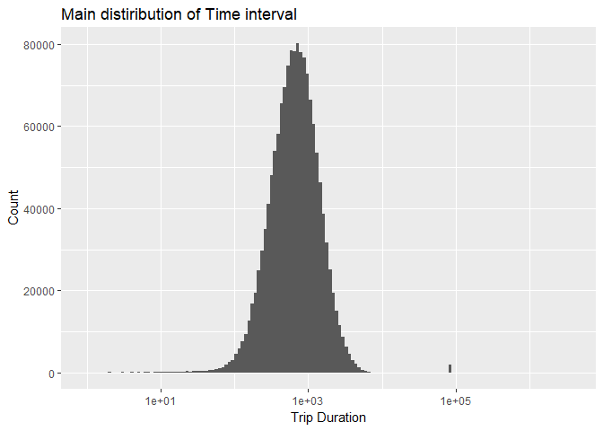

-Distribution of Timeinterval is smooth with around 1000 seconds as the
mode -There are many unrealistic rides with less then 10 seconds and
around 10000 seconds.

Thus treating these outliers
----------------------------

    mean(train[train$trip_duration<=60,]$speed)

    ## [1] 16.59599

    quantile(train[train$trip_duration<=60,]$speed)

    ##           0%          25%          50%          75%         100% 
    ##    0.0000000    0.2312313    4.2871263   21.2653556 9284.9838906

-These short trips looks real since average speed is considerable .

    mean(train[train$trip_duration>=72000,]$speed)

    ## [1] 0.1664166

    quantile(train[train$trip_duration>=72000,]$speed)

    ##         0%        25%        50%        75%       100% 
    ## 0.00000000 0.05546479 0.09781071 0.18772544 2.55257800

-These long trips are surely unrealistics since the average speed does
not fall in normal range. -Removing journey lasting greater then 20
hours

    train<-train[train$trip_duration<72000,]

    ggplot(data=train,aes(x=distance))+geom_histogram(bins = 200)+labs(x="Distance",y="Count",title="Main distiribution of Distance")

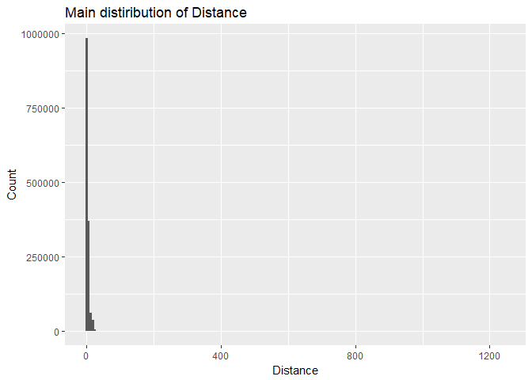

    summary(train$distance)

    ##     Min.  1st Qu.   Median     Mean  3rd Qu.     Max. 
    ##    0.000    1.233    2.096    3.444    3.879 1242.298

    quantile(train$distance)

    ##          0%         25%         50%         75%        100% 
    ##    0.000000    1.233131    2.095722    3.879161 1242.298174

-There are some unrealistic journey with zero kilometre -Also there are
few with unrealistic high kilometres -Removing These

    train<-train[train$distance!=0,]
    train<-train[train$distance<500,]

    ggplot(data=train,aes(x=pickup_date))+geom_histogram(fill="red",bins = 150)+labs(x="Pickup_date",y="Count",title="Main distribution of dates")

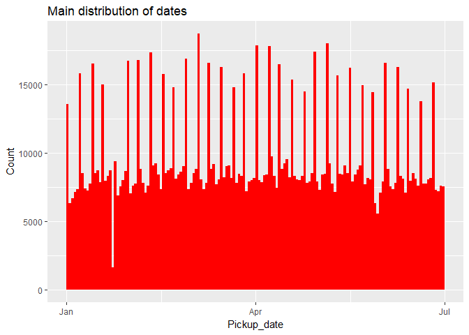

-Sudden drop in the Pickups in Late january or early february. -May be
seasonor climate effecting the rides.

    ggplot(data=train,aes(x=as.factor(passenger_count),fill=as.factor(passenger_count)))+geom_bar(stat = "count")+labs(x="Passenger_count",y="Count",title="Main distribution of No. of passengers")

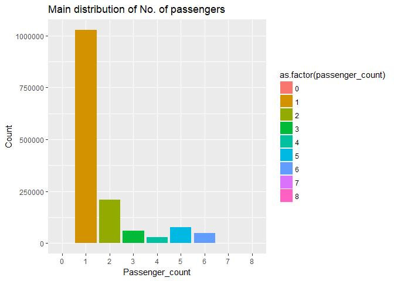

-On a general trend No. of rides decreases with increasing with no. of
passenger from 1 to 4 -From 5 onwards we see increase in the ride due to
the large cars may be. -Majority riders are single passengers.

    ggplot(data=train,aes(x=as.factor(vendor_id),fill=as.factor(vendor_id)))+geom_bar(stat = "count")+labs(x="vendor_id",y="Count",title="Main distribution of Vendors")

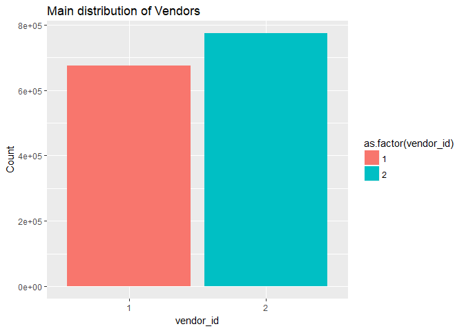

-Vendor 2 has more trips then Vendor 1

    ggplot(data=train,aes(x=as.factor(store_and_fwd_flag),fill=as.factor(store_and_fwd_flag)))+geom_bar(stat = "count")+labs(x="store_and_fwd_flag",y="Count",title="Main distribution of store_and_fwd_flag")

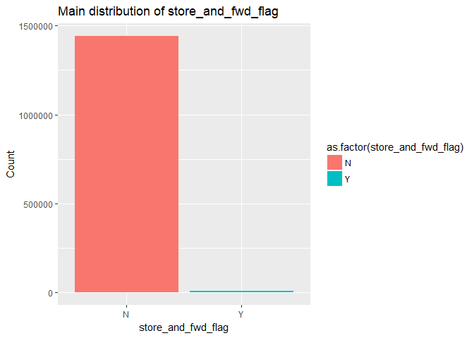

-The store\_and\_fwd\_flag values, indicating whether the trip data was
sent immediately to the vendor ("N") or held in the memory of the taxi
because there was no connection to the server ("Y"), show that there was
almost no storing taking place

    positions<-c("Monday","Tuesday","Wednesday","Thursday","Friday","Saturday","Sunday")
    ggplot(data=train,aes(as.factor(weekdays),fill=as.factor(weekdays)))+geom_bar()+scale_x_discrete(limits = positions)+geom_line(stat = "count",aes(group=1)) +labs(x="Weedays",y="Count",title="Main distribution of weekdays")

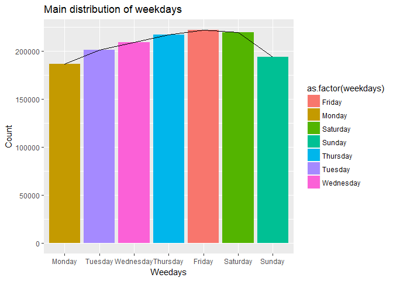

-No.of trips increases from Monday to Friday and then decreases. -Friday
has the maximumNo. of trips -Supprisingly Monday has the least trip
despite being the working day.

    ggplot(data=train,aes(as.factor(hour)))+geom_point(stat = "count")+geom_line(stat = "count",aes(group=1))+labs(x="Hour",y="Count",title="Main distribution of hours")

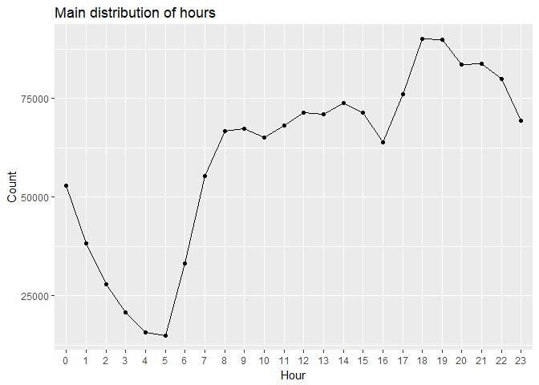

-As esxpected No.of rides are lower between 00:00:00 and 6:00:00 , and
they decreases as the time increases. -No.of rides are higher after
6:00:00 depicting office hours. -No. of rides are highest after 18:00:00

    ggplot(data=train,aes(x=distance*1000,y=trip_duration))+geom_point()+labs(x="Distance in metres",y="trip_duration",title="Main distribution of Distance vs Time")+scale_x_log10() +
      scale_y_log10()

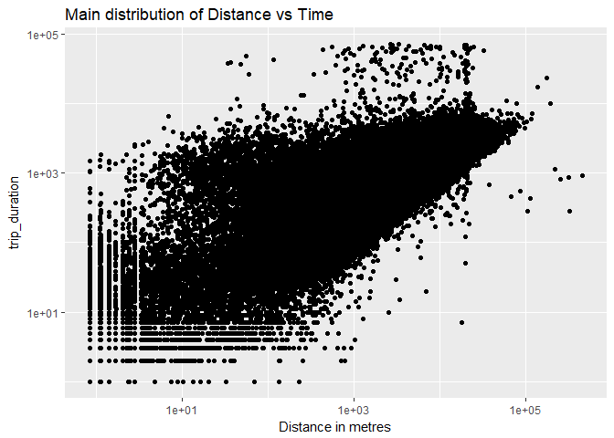

-On whole as expected time increases as distance of the tripincreases.We
can see a linear trend in the data.

    positions<-c("Monday","Tuesday","Wednesday","Thursday","Friday","Saturday","Sunday")
    train$weekdays<-as.character(train$weekdays)
    weekdaysframe<-data.frame(weekdays=character(),med=numeric())
    train$trip_duration<-as.numeric(train$trip_duration)
    for(i in positions){
      daysframe<-data.frame(weekdays=i,med=median(train[train$weekdays==i,]$trip_duration))
      weekdaysframe<-rbind(weekdaysframe,daysframe)
    }
     ggplot(data=weekdaysframe,aes(x=weekdays,y=med))+geom_point()+labs(x="Weekdays",y="Median_trip_time",title="Main distribution of Trip_time vs Weekdays")+geom_line(aes(group=1))

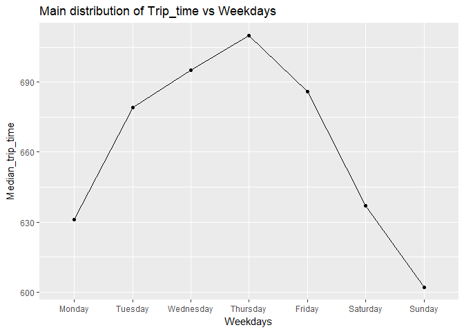

-As expected median trip time increases from monday. -Thrusday saw the
maximum trip time. -As expected triptime for Saturday and Sunday are
lower

    train$month<-as.factor(train$month)
    positions1<-levels(train$month)
    monthframe<-data.frame(month=character(),med=numeric())
    for(i in positions1){
      monthsframe<-data.frame(month=i,med=median(train[train$month==i,]$trip_duration))
      monthframe<-rbind(monthframe,monthsframe)
    }
     ggplot(data=monthframe,aes(x=month,y=med))+geom_point()+labs(x="Months",y="Median_trip_time",title="Main distribution of Trip_time vs Months")

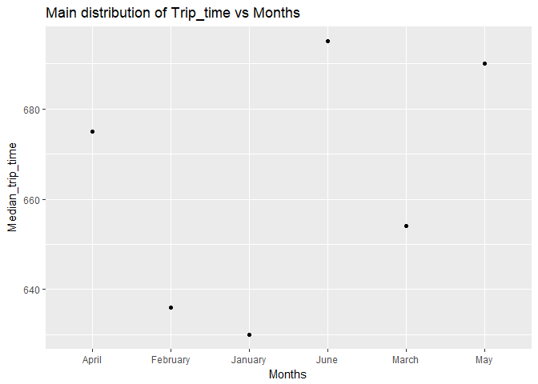

-January saw the lowest median trip time while June saw the highest.

    positions2<-c(0,1,2,3,4,5,6,7,8,9,10,11,12,13,14,15,16,17,18,19,20,21,22,23)
    hourframe<-data.frame(hour=numeric(),med=numeric())
    for(i in positions2){
      hoursframe<-data.frame(hour=i,med=median(train[train$hour==i,]$trip_duration))
      hourframe<-rbind(hourframe,hoursframe)
    }
     ggplot(data=hourframe,aes(x=hour,y=med))+geom_point()+labs(x="Hour",y="Median_trip_time",title="Main distribution of Trip_time vs Hour")

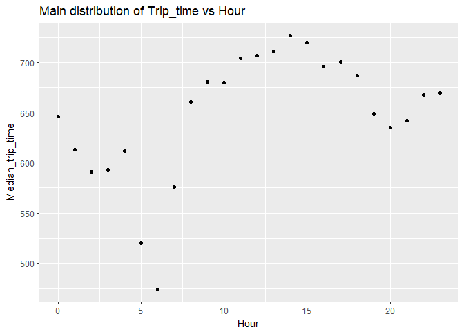

-Trip between 14:00:00 and 15:00:00 saw the maxximum trip time while
trip between 6:00:00 and 7:00:00 saw the least. - points that are from
8:00:00 are high may be due to office hours

Merging weather data with our training data by pickupdate
=========================================================

    weather<-read.csv("weather.csv")
    names(weather)[1]<-c("pickup_date")
    weather$pickup_date<-as.Date(weather$pickup_date,"%d-%m-%Y")

    train<-merge(train,weather,by="pickup_date")

    names(train)

    ##  [1] "pickup_date"         "id"                  "vendor_id"          
    ##  [4] "pickup_datetime"     "dropoff_datetime"    "passenger_count"    
    ##  [7] "pickup_longitude"    "pickup_latitude"     "dropoff_longitude"  
    ## [10] "dropoff_latitude"    "store_and_fwd_flag"  "trip_duration"      
    ## [13] "distance"            "speed"               "pickup_time"        
    ## [16] "drop_date"           "drop_time"           "month"              
    ## [19] "monthApril"          "monthFebruary"       "monthJanuary"       
    ## [22] "monthJune"           "monthMarch"          "monthMay"           
    ## [25] "weekdays"            "weekdaysFriday"      "weekdaysMonday"     
    ## [28] "weekdaysSaturday"    "weekdaysSunday"      "weekdaysThursday"   
    ## [31] "weekdaysTuesday"     "weekdaysWednesday"   "hour"               
    ## [34] "maximum.temperature" "minimum.temperature" "average.temperature"
    ## [37] "precipitation"       "snow.fall"           "snow.depth"

Preparing final traing set which include all required variable only
===================================================================

    filter<-c("pickup_date","pickup_datetime","dropoff_datetime","pickup_time","drop_date","drop_time","month","weekdays","speed")
    finaltrain<-subset(train,select = !names(train)%in% filter)

Hotencoding store\_and\_fwd\_flag and converting all variables to numeric type
==============================================================================

    finaltrain$store_and_fwd_flag<-as.character(finaltrain$store_and_fwd_flag)
    finaltrain[finaltrain$store_and_fwd_flag=="N",]$store_and_fwd_flag<-0
    finaltrain[finaltrain$store_and_fwd_flag=="Y",]$store_and_fwd_flag<-1
    finaltrain<-sapply(finaltrain,as.numeric)
    finaltrain<-as.data.frame(finaltrain)

Checking for highly corelated independnt variables and thus removing them to create more robust model.
======================================================================================================

    cordata<-as.data.frame(cor(finaltrain[,-c(1)]))
    apply(cordata,2,function(x)which(x>=0.8))

    ## $vendor_id
    ## vendor_id 
    ##         1 
    ## 
    ## $passenger_count
    ## passenger_count 
    ##               2 
    ## 
    ## $pickup_longitude
    ## pickup_longitude 
    ##                3 
    ## 
    ## $pickup_latitude
    ## pickup_latitude 
    ##               4 
    ## 
    ## $dropoff_longitude
    ## dropoff_longitude 
    ##                 5 
    ## 
    ## $dropoff_latitude
    ## dropoff_latitude 
    ##                6 
    ## 
    ## $store_and_fwd_flag
    ## store_and_fwd_flag 
    ##                  7 
    ## 
    ## $trip_duration
    ## trip_duration 
    ##             8 
    ## 
    ## $distance
    ## distance 
    ##        9 
    ## 
    ## $monthApril
    ## monthApril 
    ##         10 
    ## 
    ## $monthFebruary
    ## monthFebruary 
    ##            11 
    ## 
    ## $monthJanuary
    ## monthJanuary 
    ##           12 
    ## 
    ## $monthJune
    ## monthJune 
    ##        13 
    ## 
    ## $monthMarch
    ## monthMarch 
    ##         14 
    ## 
    ## $monthMay
    ## monthMay 
    ##       15 
    ## 
    ## $weekdaysFriday
    ## weekdaysFriday 
    ##             16 
    ## 
    ## $weekdaysMonday
    ## weekdaysMonday 
    ##             17 
    ## 
    ## $weekdaysSaturday
    ## weekdaysSaturday 
    ##               18 
    ## 
    ## $weekdaysSunday
    ## weekdaysSunday 
    ##             19 
    ## 
    ## $weekdaysThursday
    ## weekdaysThursday 
    ##               20 
    ## 
    ## $weekdaysTuesday
    ## weekdaysTuesday 
    ##              21 
    ## 
    ## $weekdaysWednesday
    ## weekdaysWednesday 
    ##                22 
    ## 
    ## $hour
    ## hour 
    ##   23 
    ## 
    ## $maximum.temperature
    ## maximum.temperature minimum.temperature average.temperature 
    ##                  24                  25                  26 
    ## 
    ## $minimum.temperature
    ## maximum.temperature minimum.temperature average.temperature 
    ##                  24                  25                  26 
    ## 
    ## $average.temperature
    ## maximum.temperature minimum.temperature average.temperature 
    ##                  24                  25                  26 
    ## 
    ## $precipitation
    ## precipitation 
    ##            27 
    ## 
    ## $snow.fall
    ## snow.fall 
    ##        28 
    ## 
    ## $snow.depth
    ## snow.depth 
    ##         29

-maximum,minimum and average temperature are highly corelated.

    filter1<-c("minimum.temperature","average.temperature")
    finaltrain<-subset(finaltrain,select = !names(finaltrain)%in% filter1)

-Removing minimum.temperature and average.temperature variable from
model

preparing test data to the required format
==========================================

    test$distance<-apply(test,1,function(i) distCosine(c(as.numeric(i[5]),as.numeric(i[6])),c(as.numeric(i[7]),as.numeric(i[8]))))
    test$distance<-test$distance/1000
    test$pickup_datetime<-as.character(test$pickup_datetime)
    pickupsplit_list<-strsplit(test$pickup_datetime,split = " ")
    pickupsplit_df<-ldply(pickupsplit_list)
    names(pickupsplit_df)<-c("pickup_date","pickup_time")
    test<-cbind(test,pickupsplit_df)

    test$pickup_date<-as.Date(test$pickup_date,format = '%Y-%m-%d')
    test$month<-months(test$pickup_date)
    month_c<-as.data.frame(with(test, model.matrix(~ month + 0)))
    test<-cbind(test,month_c)
    test$weekdays<-weekdays(test$pickup_date)
    weekdays_c<-as.data.frame(with(test,model.matrix(~weekdays + 0)))
    test<-cbind(test,weekdays_c)
    test$pickup_time<-strptime(test$pickup_time,"%H:%M:%S")
    test$pickup_time<-as.POSIXct(test$pickup_time)

    test$hour<-substr(test$pickup_time, start = 12, stop = 13)
    test$hour<-as.numeric(test$hour)

    test<-merge(test,weather,by="pickup_date")

    filter<-c("pickup_date","pickup_datetime","pickup_time","month","weekdays")
    finaltest<-subset(test,select = !names(test)%in% filter)

    finaltest$store_and_fwd_flag<-as.character(finaltest$store_and_fwd_flag)
    finaltest[finaltest$store_and_fwd_flag=="N",]$store_and_fwd_flag<-0
    finaltest[finaltest$store_and_fwd_flag=="Y",]$store_and_fwd_flag<-1
    id<-finaltest$id
    finaltest<-sapply(finaltest,as.numeric)
    finaltest<-as.data.frame(finaltest)

    filter1<-c("minimum.temperature","average.temperature")
    finaltest<-subset(finaltest,select = !names(finaltest)%in% filter1)

Training the XG-Boost model.
============================

    duration<-(finaltrain$trip_duration)/60
    xgb <- xgboost(data = data.matrix(finaltrain[,-c(1,9)]),
     label = duration,
     eta = 0.3,
     nround=70,
     subsample = 0.7,
     colsample_bytree = 0.7,
     seed = 1,
     eval_metric = "rmse",
     objective = "reg:linear",
     max_depth=8
    )

    ## [1]  train-rmse:14.775782 
    ## [2]  train-rmse:12.198784 
    ## [3]  train-rmse:10.853897 
    ## [4]  train-rmse:9.890765 
    ## [5]  train-rmse:9.335280 
    ## [6]  train-rmse:9.030992 
    ## [7]  train-rmse:8.856312 
    ## [8]  train-rmse:8.738768 
    ## [9]  train-rmse:8.646724 
    ## [10] train-rmse:8.573578 
    ## [11] train-rmse:8.490113 
    ## [12] train-rmse:8.399808 
    ## [13] train-rmse:8.351627 
    ## [14] train-rmse:8.309468 
    ## [15] train-rmse:8.275695 
    ## [16] train-rmse:8.241866 
    ## [17] train-rmse:8.197863 
    ## [18] train-rmse:8.152927 
    ## [19] train-rmse:8.110379 
    ## [20] train-rmse:8.020235 
    ## [21] train-rmse:7.989242 
    ## [22] train-rmse:7.930293 
    ## [23] train-rmse:7.907332 
    ## [24] train-rmse:7.901701 
    ## [25] train-rmse:7.871430 
    ## [26] train-rmse:7.821364 
    ## [27] train-rmse:7.799322 
    ## [28] train-rmse:7.777715 
    ## [29] train-rmse:7.730423 
    ## [30] train-rmse:7.702798 
    ## [31] train-rmse:7.665994 
    ## [32] train-rmse:7.652377 
    ## [33] train-rmse:7.635303 
    ## [34] train-rmse:7.616077 
    ## [35] train-rmse:7.601493 
    ## [36] train-rmse:7.551721 
    ## [37] train-rmse:7.522964 
    ## [38] train-rmse:7.503357 
    ## [39] train-rmse:7.450528 
    ## [40] train-rmse:7.424854 
    ## [41] train-rmse:7.408352 
    ## [42] train-rmse:7.388852 
    ## [43] train-rmse:7.378784 
    ## [44] train-rmse:7.375376 
    ## [45] train-rmse:7.347912 
    ## [46] train-rmse:7.336493 
    ## [47] train-rmse:7.313431 
    ## [48] train-rmse:7.311902 
    ## [49] train-rmse:7.294017 
    ## [50] train-rmse:7.254560 
    ## [51] train-rmse:7.227093 
    ## [52] train-rmse:7.207227 
    ## [53] train-rmse:7.184614 
    ## [54] train-rmse:7.156624 
    ## [55] train-rmse:7.140426 
    ## [56] train-rmse:7.130481 
    ## [57] train-rmse:7.112310 
    ## [58] train-rmse:7.088763 
    ## [59] train-rmse:7.080992 
    ## [60] train-rmse:7.077843 
    ## [61] train-rmse:7.075983 
    ## [62] train-rmse:7.057931 
    ## [63] train-rmse:7.055563 
    ## [64] train-rmse:7.042974 
    ## [65] train-rmse:7.028025 
    ## [66] train-rmse:7.011446 
    ## [67] train-rmse:7.003713 
    ## [68] train-rmse:6.977921 
    ## [69] train-rmse:6.946950 
    ## [70] train-rmse:6.939531

Cross-validating the model
==========================

    # xgb_cv <- xgb.cv(data=data.matrix(finaltrain[,-c(1,9)]),label = duration, 
    #  eta = 0.3,
    #  nround=100, 
    #  subsample = 0.7,
    #  colsample_bytree = 0.7,
    #  seed = 1,
    #  eval_metric = "rmse",
    #  objective = "reg:linear",
    #  nfold=5,
    #  max_depth=8,
    #  early.stop.round=3)

-Validating the modelby checking rmse and finding the optimum n round
value -Iteration stops at optimum value of nround

Predicting the test data
========================

    y_pred <- predict(xgb, data.matrix(finaltest[,-1]))
    output<-data.frame(id=id,trip_duration_predicted=y_pred)

Checking the importanceof features
==================================

    important <- as.data.frame(xgb.importance(feature_names = colnames(finaltrain[,-c(1,9)]), model = xgb))
    ggplot(important,aes(x=Feature,y=Gain,fill=Feature))+geom_bar(stat = "identity")

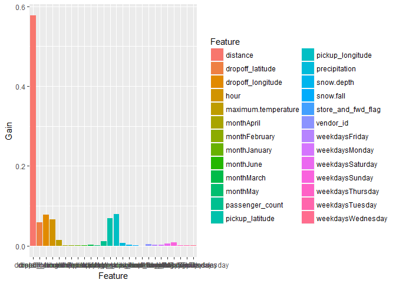

-As expected Distance come out to be most important feature.

A more accurate but time consuming way of traing the model (For supercomputers)
===============================================================================

    # set.seed(1001)
    #   getParamSet("regr.xgboost")
    #   xg_set <- makeLearner("regr.xgboost", predict.type = "response")
    #   xg_set$par.vals <- list(
    #     objective = "reg:linear",
    #     eval_metric = "rmse",
    #     nrounds = 10
    #   )
    #   xg_ps <- makeParamSet(
    #     makeIntegerParam("nrounds",lower=9,upper=81),
    #     makeIntegerParam("max_depth",lower=6,upper=15),
    #     makeNumericParam("lambda",lower=0.50,upper=0.60),
    #     makeNumericParam("eta", lower = 0.001, upper = 0.3),
    #     makeNumericParam("subsample", lower = 0.50, upper = 1),
    #     makeNumericParam("min_child_weight",lower=1,upper=5),
    #     makeNumericParam("colsample_bytree",lower = 0.5,upper = 0.9)
    #   )
    #   rancontrol <- makeTuneControlRandom(maxit = 100L) #do 100 iterations
    #   set_cv <- makeResampleDesc("CV",iters = 5L)
    # 
    #     traintask_1 <- makeRegrTask(data=finaltrain[,-c(1)],target="time_duration")
    #     xg_tune <- tuneParams(learner = xg_set, task = traintask_1, resampling = set_cv,measures =mse,par.set = xg_ps, control = rancontrol)
    #     #set parameters
    #     xg_new <- setHyperPars(learner = xg_set, par.vals = xg_tune$x)
    #     #train model
    #     xgmodel_acc <- train(xg_new, traintask_1)
    #     predict.xg <- predict(xgmodel_acc,newdata=finaltest[,-c(1)])
    #     pred<-predict.xg$data
    #     pred<-pred$response
    #     pred<-pred*60
    #     output<-data.frame(id=id,trip_duration_predicted=y_pred)

-This method provide a more detailed investigation of tunning the
parameters by random search over a range of values of hyperparameters
many times. -It finally tune the parametrs to which the model results
mmaximum validation set accuracy.
